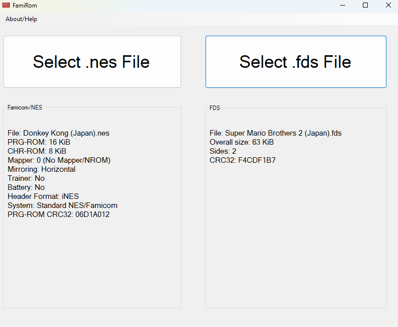

# FamiRom

*Version 1.2

# RU:
FamiRom программа чтобы узнавать информацию о .nes/fds файлах.
На данный момент версия 1.2

Версии:

1.2 - Немного изменён интерфейс, добавлена поддержка .fds файлов

1.1 - Добавлены названия Мапперов

1.0 - Первый Релиз

# EN:
FamiRom is a program to find out information about .nes/fds files.
At the moment version 1.2

Versions:

1.2 - The interface has been slightly changed, support for .fds files has been added.

1.1 - Added names Mappers

1.0 - First Realease
